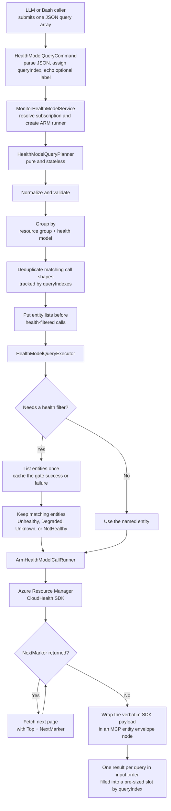
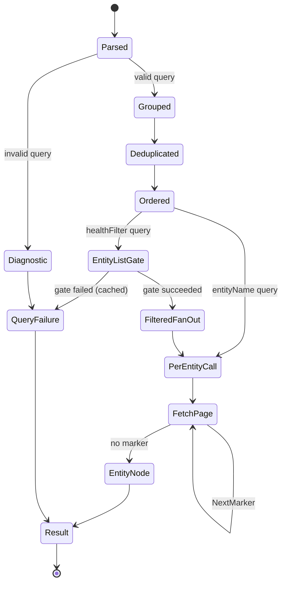
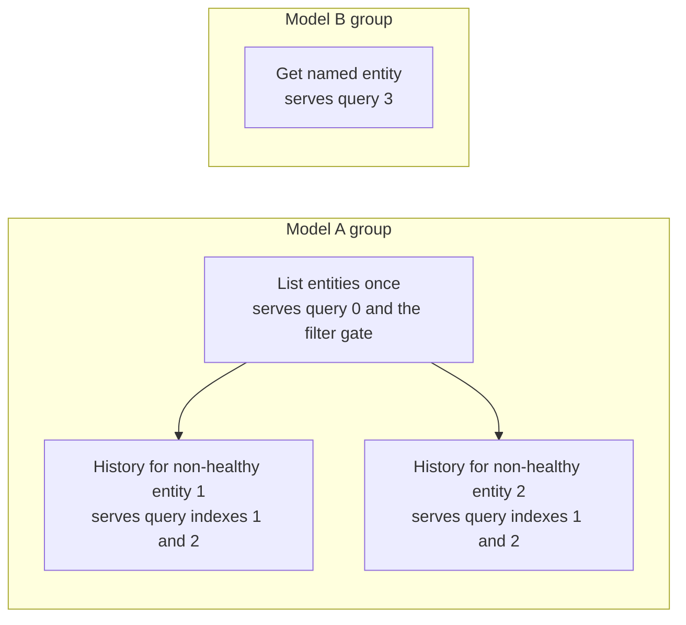

# Azure Monitor Health Model batch queries

## ELI5

Think of the query tool as a librarian who accepts one shopping list.

Each line on the list says:

- what you want, such as entities or history;
- which health model contains it;
- which entity to inspect, or which health states to select;
- an optional `label` the librarian copies onto the answer for your convenience.

You do not number the lines. The librarian answers them in the same order you wrote them and stamps each answer with its zero-based `queryIndex` (line 0, line 1, and so on), so you always know which answer belongs to which request.

The librarian checks the list, sorts related requests together, removes duplicates, and fetches shared information once. If three requests need the list of unhealthy entities from the same model, the tool lists that model's entities once. It then runs the three requests against the matching entities.

Azure does not provide one bulk history API. The tool cannot turn ten distinct entity-history reads into one Azure request. It saves calls by removing duplicates, reusing entity lists, and skipping entities that do not match the health filter.

## End-to-end flow



## The small state machine



The implementation uses records, enums, and pure functions instead of a general state-machine framework. The plan itself describes the states and dependencies.

## Query kinds

| `kind` | What it returns | Important fields |
|---|---|---|
| `entityList` | All entities in a model | Optional `timestamp` for a point-in-time snapshot |
| `entityGet` | One entity | `entityName` |
| `entityHistory` | Health-state changes | `entityName` or `healthFilter`; optional time window and `top` |
| `signalHistory` | Signal values and health states | `signalName`, plus `entityName` or `healthFilter` |
| `signalRecommendations` | Recommended signals and configurations | `entityName` or `healthFilter` |
| `dataAnnotations` | Entity annotations | `entityName` or `healthFilter`; optional time window and `top` |

Every query may also carry an optional `label` (a free-form string). The command copies it verbatim onto the result and excludes it from planning, dedupe, and routing. Duplicate labels and omitted labels are both valid.

Use either `entityName` or `healthFilter` for `entityHistory`, `signalHistory`, `signalRecommendations`, and `dataAnnotations`. `entityGet` accepts only `entityName` and rejects a query that omits it; `entityList` takes neither.

Supported health filters:

- `unhealthy`
- `degraded`
- `unknown`
- `notHealthy`, which means any non-empty state other than `Healthy`

## Worked example

Suppose one batch contains:

1. List every entity in model A.
2. Get history for every non-healthy entity in model A.
3. Repeat request 2 (a byte-identical duplicate query).
4. Get one entity from model B.

Assume model A contains two non-healthy entities.

Without planning, a caller could perform:

- one list for request 1;
- one list plus two history calls for request 2;
- another list plus two duplicate history calls for request 3;
- one entity call for request 4.

That is eight logical Azure calls.

The planner produces:



The plan now has four logical calls. A history call can still produce several HTTP requests when Azure returns a `NextMarker`; the runner aggregates every page into one SDK payload.

## What each implementation layer does

| Layer | File | Job |
|---|---|---|
| Typed request | `Models/HealthModels/HealthModelQuery.cs` | Defines the JSON input contract (kind, scope, optional `label`) |
| Command | `Commands/HealthModels/HealthModelQueryCommand.cs` | Parses `--queries`, rejects empty or malformed batches, echoes each `label` onto its result, and returns HTTP-style errors |
| Planner | `Planning/HealthModelQueryPlanner.cs` | Pure transformation from queries to an immutable grouped plan, tracking each call's `queryIndexes` |
| Executor | `Planning/HealthModelQueryExecutor.cs` | Fills a pre-sized result slot per query, runs the cached entity-list gate, applies health filters, and isolates per-entity failures |
| Entity envelope | `Models/HealthModels/HealthModelEntityResult.cs` | The uniform per-entity node carrying `entityName`/`success`/`error`/`signalName` plus exactly one SDK payload |
| Serializer bridge | `Commands/HealthModels/HealthModelEntityResultConverter.cs` | Output-only converter that writes each SDK payload through its generated `IJsonModel<T>` serializer, keeping SDK types out of the source-gen graph |
| ARM runner | `Services/ArmHealthModelCallRunner.cs` | Calls the CloudHealth SDK and returns the verbatim SDK DTOs, rebuilding paginated wrappers with `ArmCloudHealthModelFactory` and a null marker |
| Pagination | `Services/HealthModelPaginator.cs` | Follows `NextMarker`, preserves page order, honors cancellation, and rejects repeated markers |
| Page requests | `Services/HealthModelRequestContent.cs` | Sends time bounds on page 1, then sends only `Top` and `NextMarker` |
| Typed result | `Models/HealthModels/HealthModelQueryResult.cs` | Returns `queryIndex`, optional `label`, `kind`, `success`, and the uniform list of entity nodes |

The planner has no Azure client, network call, or mutable global state. The ARM runner owns the I/O.

## Error and cancellation behavior

- A malformed batch (not a JSON array, or an empty array) fails command validation.
- A planning error becomes a whole-query failure (`success: false`) for that query.
- A failed shared entity-list gate fails every dependent health-filtered query. The executor attempts the list once, which prevents a retry storm.
- Once fan-out begins, the failing entity's node records the Azure error (`success: false` with an `error`) while its sibling entities and the overall query still succeed.
- Cancellation from the caller stops the batch instead of returning a successful response with item errors.
- A repeated continuation marker throws an error instead of looping forever or returning truncated data.

## Copy-paste Bash example

### 1. Build the local CLI

Run this from the repository root:

```bash
dotnet build servers/Azure.Mcp.Server/src
az login
```

### 2. Set your Azure values

```bash
export SUBSCRIPTION="your-subscription-id-or-name"
export RESOURCE_GROUP="your-resource-group"
export HEALTH_MODEL="your-health-model"
```

### 3. Run a useful batch

This batch lists all entities and gets complete history for every entity that is not healthy. The input has no `id`; the command copies the optional `label` onto the result for readability.

```bash
#!/usr/bin/env bash
set -euo pipefail

: "${SUBSCRIPTION:?Set SUBSCRIPTION first}"
: "${RESOURCE_GROUP:?Set RESOURCE_GROUP first}"
: "${HEALTH_MODEL:?Set HEALTH_MODEL first}"

AZMCP=(
  dotnet
  "$PWD/servers/Azure.Mcp.Server/src/bin/Debug/net10.0/azmcp.dll"
)

QUERIES="$(
  jq -cn \
    --arg resourceGroup "$RESOURCE_GROUP" \
    --arg healthModel "$HEALTH_MODEL" \
    '[
      {
        label: "all entities",
        kind: "entityList",
        resourceGroup: $resourceGroup,
        healthModel: $healthModel
      },
      {
        label: "non-healthy history",
        kind: "entityHistory",
        resourceGroup: $resourceGroup,
        healthModel: $healthModel,
        healthFilter: "notHealthy",
        top: 100
      }
    ]'
)"

"${AZMCP[@]}" monitor healthmodels query \
  --subscription "$SUBSCRIPTION" \
  --queries "$QUERIES" |
  jq .
```

If you installed `azmcp` on your `PATH`, replace:

```bash
"${AZMCP[@]}" monitor healthmodels query
```

with:

```bash
azmcp monitor healthmodels query
```

### 4. Add signal history

Set a signal name that exists in your model:

```bash
export SIGNAL_NAME="your-signal-name"

QUERIES="$(
  jq -cn \
    --arg resourceGroup "$RESOURCE_GROUP" \
    --arg healthModel "$HEALTH_MODEL" \
    --arg signalName "$SIGNAL_NAME" \
    '[
      {
        label: "unhealthy signal history",
        kind: "signalHistory",
        resourceGroup: $resourceGroup,
        healthModel: $healthModel,
        healthFilter: "unhealthy",
        signalName: $signalName,
        top: 100
      }
    ]'
)"

"${AZMCP[@]}" monitor healthmodels query \
  --subscription "$SUBSCRIPTION" \
  --queries "$QUERIES" |
  jq .
```

### 5. Query a point-in-time snapshot

```bash
QUERIES="$(
  jq -cn \
    --arg resourceGroup "$RESOURCE_GROUP" \
    --arg healthModel "$HEALTH_MODEL" \
    '[
      {
        label: "snapshot",
        kind: "entityList",
        resourceGroup: $resourceGroup,
        healthModel: $healthModel,
        timestamp: "2026-07-24T12:00:00Z"
      }
    ]'
)"

"${AZMCP[@]}" monitor healthmodels query \
  --subscription "$SUBSCRIPTION" \
  --queries "$QUERIES" |
  jq .
```

## Query cookbook

The examples below use the `AZMCP`, `SUBSCRIPTION`, `RESOURCE_GROUP`, and `HEALTH_MODEL` values from the Bash setup above.

Add a helper that accepts a JSON array on standard input:

```bash
hmq() {
  local queries
  if ! queries="$(
    jq -ce '
      if type == "array" and length > 0
      then .
      else error("queries must be a non-empty JSON array")
      end
    '
  )"; then
    return 1
  fi

  "${AZMCP[@]}" monitor healthmodels query \
    --subscription "$SUBSCRIPTION" \
    --queries "$queries" |
    jq .
}
```

Set values used by the entity and signal examples:

```bash
export ENTITY_NAME="your-entity-name"
export SECOND_ENTITY_NAME="another-entity-name"
export SIGNAL_NAME="your-signal-name"
```

### List the current entities

Labels are optional. The result still carries `queryIndex: 0`.

```bash
jq -cn \
  --arg rg "$RESOURCE_GROUP" \
  --arg hm "$HEALTH_MODEL" \
  '[
    {
      kind: "entityList",
      resourceGroup: $rg,
      healthModel: $hm
    }
  ]' |
  hmq
```

### Get one entity

```bash
jq -cn \
  --arg rg "$RESOURCE_GROUP" \
  --arg hm "$HEALTH_MODEL" \
  --arg entity "$ENTITY_NAME" \
  '[
    {
      label: "get one entity",
      kind: "entityGet",
      resourceGroup: $rg,
      healthModel: $hm,
      entityName: $entity
    }
  ]' |
  hmq
```

### Get one entity's complete health history

Omitting `startTime` and `endTime` uses the service defaults. The runner follows every continuation marker.

```bash
jq -cn \
  --arg rg "$RESOURCE_GROUP" \
  --arg hm "$HEALTH_MODEL" \
  --arg entity "$ENTITY_NAME" \
  '[
    {
      label: "complete entity history",
      kind: "entityHistory",
      resourceGroup: $rg,
      healthModel: $hm,
      entityName: $entity,
      top: 100
    }
  ]' |
  hmq
```

### Get entity history for a time window

`top` controls the page size, not the total result count.

```bash
jq -cn \
  --arg rg "$RESOURCE_GROUP" \
  --arg hm "$HEALTH_MODEL" \
  --arg entity "$ENTITY_NAME" \
  '[
    {
      label: "entity history last day",
      kind: "entityHistory",
      resourceGroup: $rg,
      healthModel: $hm,
      entityName: $entity,
      startTime: "2026-07-23T00:00:00Z",
      endTime: "2026-07-24T00:00:00Z",
      top: 25
    }
  ]' |
  hmq
```

### Compare every health filter

The planner shares one current entity-list call across these four queries.

```bash
jq -cn \
  --arg rg "$RESOURCE_GROUP" \
  --arg hm "$HEALTH_MODEL" \
  '[
    {
      label: "unhealthy histories",
      kind: "entityHistory",
      resourceGroup: $rg,
      healthModel: $hm,
      healthFilter: "unhealthy"
    },
    {
      label: "degraded histories",
      kind: "entityHistory",
      resourceGroup: $rg,
      healthModel: $hm,
      healthFilter: "degraded"
    },
    {
      label: "unknown histories",
      kind: "entityHistory",
      resourceGroup: $rg,
      healthModel: $hm,
      healthFilter: "unknown"
    },
    {
      label: "all non-healthy histories",
      kind: "entityHistory",
      resourceGroup: $rg,
      healthModel: $hm,
      healthFilter: "notHealthy"
    }
  ]' |
  hmq
```

### Get signal history for one entity

```bash
jq -cn \
  --arg rg "$RESOURCE_GROUP" \
  --arg hm "$HEALTH_MODEL" \
  --arg entity "$ENTITY_NAME" \
  --arg signal "$SIGNAL_NAME" \
  '[
    {
      label: "one entity signal history",
      kind: "signalHistory",
      resourceGroup: $rg,
      healthModel: $hm,
      entityName: $entity,
      signalName: $signal,
      top: 100
    }
  ]' |
  hmq
```

### Get signal history for every unhealthy entity

```bash
jq -cn \
  --arg rg "$RESOURCE_GROUP" \
  --arg hm "$HEALTH_MODEL" \
  --arg signal "$SIGNAL_NAME" \
  '[
    {
      label: "unhealthy signal history",
      kind: "signalHistory",
      resourceGroup: $rg,
      healthModel: $hm,
      healthFilter: "unhealthy",
      signalName: $signal,
      startTime: "2026-07-23T00:00:00Z",
      endTime: "2026-07-24T00:00:00Z",
      top: 50
    }
  ]' |
  hmq
```

### Get signal recommendations for one entity

```bash
jq -cn \
  --arg rg "$RESOURCE_GROUP" \
  --arg hm "$HEALTH_MODEL" \
  --arg entity "$ENTITY_NAME" \
  '[
    {
      label: "signal recommendations",
      kind: "signalRecommendations",
      resourceGroup: $rg,
      healthModel: $hm,
      entityName: $entity
    }
  ]' |
  hmq
```

### Get recommendations for every non-healthy entity

```bash
jq -cn \
  --arg rg "$RESOURCE_GROUP" \
  --arg hm "$HEALTH_MODEL" \
  '[
    {
      label: "non-healthy recommendations",
      kind: "signalRecommendations",
      resourceGroup: $rg,
      healthModel: $hm,
      healthFilter: "notHealthy"
    }
  ]' |
  hmq
```

### Get data annotations for one entity

```bash
jq -cn \
  --arg rg "$RESOURCE_GROUP" \
  --arg hm "$HEALTH_MODEL" \
  --arg entity "$ENTITY_NAME" \
  '[
    {
      label: "entity annotations",
      kind: "dataAnnotations",
      resourceGroup: $rg,
      healthModel: $hm,
      entityName: $entity,
      startTime: "2026-07-01T00:00:00Z",
      endTime: "2026-07-24T00:00:00Z",
      top: 100
    }
  ]' |
  hmq
```

### Get annotations for degraded entities

```bash
jq -cn \
  --arg rg "$RESOURCE_GROUP" \
  --arg hm "$HEALTH_MODEL" \
  '[
    {
      label: "degraded annotations",
      kind: "dataAnnotations",
      resourceGroup: $rg,
      healthModel: $hm,
      healthFilter: "degraded",
      top: 100
    }
  ]' |
  hmq
```

### Query two named entities in one batch

```bash
jq -cn \
  --arg rg "$RESOURCE_GROUP" \
  --arg hm "$HEALTH_MODEL" \
  --arg first "$ENTITY_NAME" \
  --arg second "$SECOND_ENTITY_NAME" \
  '[
    {
      label: "first entity",
      kind: "entityGet",
      resourceGroup: $rg,
      healthModel: $hm,
      entityName: $first
    },
    {
      label: "second entity",
      kind: "entityGet",
      resourceGroup: $rg,
      healthModel: $hm,
      entityName: $second
    }
  ]' |
  hmq
```

### Run a mixed model-health investigation

This batch lists the model, gets one entity, and fans out three read kinds over non-healthy entities. The executor reuses one entity-list gate.

```bash
jq -cn \
  --arg rg "$RESOURCE_GROUP" \
  --arg hm "$HEALTH_MODEL" \
  --arg entity "$ENTITY_NAME" \
  --arg signal "$SIGNAL_NAME" \
  '[
    {
      label: "model entities",
      kind: "entityList",
      resourceGroup: $rg,
      healthModel: $hm
    },
    {
      label: "selected entity",
      kind: "entityGet",
      resourceGroup: $rg,
      healthModel: $hm,
      entityName: $entity
    },
    {
      label: "non-healthy histories",
      kind: "entityHistory",
      resourceGroup: $rg,
      healthModel: $hm,
      healthFilter: "notHealthy",
      top: 100
    },
    {
      label: "non-healthy signal histories",
      kind: "signalHistory",
      resourceGroup: $rg,
      healthModel: $hm,
      healthFilter: "notHealthy",
      signalName: $signal,
      top: 100
    },
    {
      label: "non-healthy annotations",
      kind: "dataAnnotations",
      resourceGroup: $rg,
      healthModel: $hm,
      healthFilter: "notHealthy",
      top: 100
    }
  ]' |
  hmq
```

### Show deduplication with identical queries

The two inputs occupy separate result slots (`queryIndex` 0 and 1), but the planner issues one logical Azure history call. Duplicate labels are valid because labels do not route results.

```bash
jq -cn \
  --arg rg "$RESOURCE_GROUP" \
  --arg hm "$HEALTH_MODEL" \
  --arg entity "$ENTITY_NAME" \
  '[
    {
      label: "same label",
      kind: "entityHistory",
      resourceGroup: $rg,
      healthModel: $hm,
      entityName: $entity,
      top: 100
    },
    {
      label: "same label",
      kind: "entityHistory",
      resourceGroup: $rg,
      healthModel: $hm,
      entityName: $entity,
      top: 100
    }
  ]' |
  hmq
```

### Query two health models

The planner creates one group per resource-group and health-model pair.

```bash
export SECOND_RESOURCE_GROUP="another-resource-group"
export SECOND_HEALTH_MODEL="another-health-model"

jq -cn \
  --arg rg1 "$RESOURCE_GROUP" \
  --arg hm1 "$HEALTH_MODEL" \
  --arg rg2 "$SECOND_RESOURCE_GROUP" \
  --arg hm2 "$SECOND_HEALTH_MODEL" \
  '[
    {
      label: "first model",
      kind: "entityList",
      resourceGroup: $rg1,
      healthModel: $hm1
    },
    {
      label: "second model",
      kind: "entityList",
      resourceGroup: $rg2,
      healthModel: $hm2
    },
    {
      label: "second model unhealthy",
      kind: "entityHistory",
      resourceGroup: $rg2,
      healthModel: $hm2,
      healthFilter: "unhealthy"
    }
  ]' |
  hmq
```

### Keep a reusable query file

Create `health-queries.json`:

```json
[
  {
    "label": "entities",
    "kind": "entityList",
    "resourceGroup": "your-resource-group",
    "healthModel": "your-health-model"
  },
  {
    "label": "unhealthy history",
    "kind": "entityHistory",
    "resourceGroup": "your-resource-group",
    "healthModel": "your-health-model",
    "healthFilter": "unhealthy",
    "top": 100
  }
]
```

Run it:

```bash
"${AZMCP[@]}" monitor healthmodels query \
  --subscription "$SUBSCRIPTION" \
  --queries "$(jq -c . health-queries.json)" |
  jq .
```

### Extract useful fields from results

Show each query's status:

```bash
jq '.results[] | {
  queryIndex,
  label,
  kind,
  success,
  error,
  entityCount: (.entities | length)
}'
```

Show only failed queries or entity reads:

```bash
jq '[
  .results[] |
  select(.success == false or any(.entities[]?; .success == false)) |
  {
    queryIndex,
    label,
    queryError: .error,
    entityErrors: [
      .entities[]? |
      select(.success == false) |
      {entityName, error}
    ]
  }
]'
```

List the current entity health states from an `entityList` result:

```bash
jq -r '
  .results[] |
  select(.kind == "entityList" and .success) |
  .entities[] |
  [.entityName, .entity.properties.healthState] |
  @tsv
'
```

## Result shape

The command returns one item for each input query, in input order, correlated by a zero-based `queryIndex`. Every query returns a uniform list of per-entity nodes; each node carries the verbatim `Azure.ResourceManager.CloudHealth` SDK payload for its kind (for example `entity.properties.healthState`, `history.history[]` with `occurredAt`, `annotations.annotations[]` with `createdAt`, `recommendations.recommendedSignals[]`).

The query items are in `results`, so use `.results[]`.

```json
{
  "status": 200,
  "message": "",
  "results": [
    {
      "queryIndex": 0,
      "label": "all entities",
      "kind": "entityList",
      "success": true,
      "entities": [
        {
          "entityName": "web-api",
          "success": true,
          "entity": {
            "name": "web-api",
            "type": "Microsoft.CloudHealth/healthmodels/entities",
            "properties": {
              "displayName": "Web API",
              "impact": "Standard",
              "healthState": "Unhealthy"
            }
          }
        }
      ]
    },
    {
      "queryIndex": 1,
      "label": "non-healthy history",
      "kind": "entityHistory",
      "success": true,
      "entities": [
        {
          "entityName": "web-api",
          "success": true,
          "history": {
            "entityName": "web-api",
            "history": [
              {
                "previousState": "Healthy",
                "newState": "Unhealthy",
                "occurredAt": "2026-07-24T11:59:00.0000000Z"
              }
            ]
          }
        }
      ]
    }
  ],
  "duration": 412
}
```

This example shortens the `entity` payload: the SDK emits every optional field Azure returned (such as `id`, `kind`, `systemData`, and further `properties` members), and the example keeps only the fields the recipes above read.

Each entity node populates exactly one SDK payload key (`entity`, `history`, `signalHistory`, `recommendations`, or `annotations`); the serializer omits the others. A node's `success` is `false` with an `error` only when that specific entity's read failed. The serializer also omits an absent `label`.
